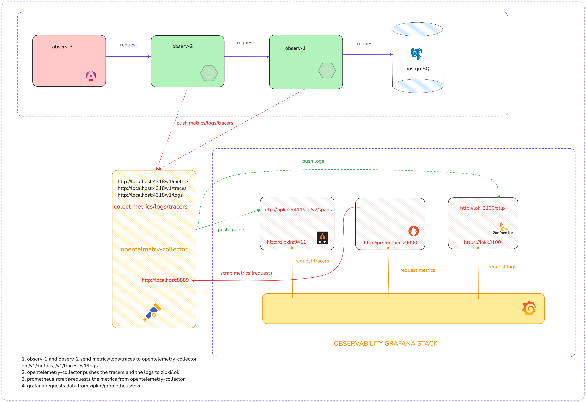

# Observability

---

Tow microservice architecture that sends metrics/logs/tracers to an otel-collector and pushes all the
information to zipkin/prometheus/loki to be used in grafana dashboard.




### To make observables work you will need the following dependencies:

1. spring actuator:
````xml
<dependency>
    <groupId>org.springframework.boot</groupId>
    <artifactId>spring-boot-starter-actuator</artifactId>
</dependency>
````
2. for database observability you will need:
````xml
<dependency>
    <groupId>net.ttddyy.observation</groupId>
    <artifactId>datasource-micrometer-spring-boot</artifactId>
    <version>1.1.0</version>
</dependency>
````
3. transform tracing in otel format:
````xml
<dependency>
    <groupId>io.micrometer</groupId>
    <artifactId>micrometer-tracing-bridge-otel</artifactId>
    <version>1.4.5</version>
</dependency>
````
4. export everything to otel-collector:
````xml
<dependency>
    <groupId>io.opentelemetry</groupId>
    <artifactId>opentelemetry-exporter-otlp</artifactId>
    <version>1.43.0</version>
</dependency>
````
5. add the appender. This is need it to send logs:
```xml
<dependency>
    <groupId>io.opentelemetry.instrumentation</groupId>
    <artifactId>opentelemetry-logback-appender-1.0</artifactId>
    <version>2.14.0-alpha</version>
</dependency>
```
6. add the [logback-spring.xml](src/main/resources/logback-spring.xml) file appender to send logs to loki

7. in order for all this to work we need to initialize an instance of OpenTelemetryAppender:
```java
@Configuration
@RequiredArgsConstructor
public class OtlConfg implements InitializingBean {

    private final OpenTelemetry openTelemetry;


    @Override
    public void afterPropertiesSet() {
        OpenTelemetryAppender.install(this.openTelemetry);
    }
}
```

### To create the grafana stack use the [docker-compose.yml](docker-compose.yml) file

observ-2:
<br>
observ-3:

#### Inspiratin: https://www.youtube.com/watch?v=UC09F-yGMG4

